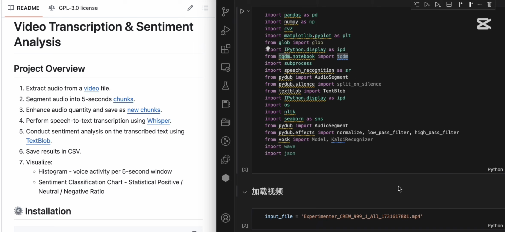
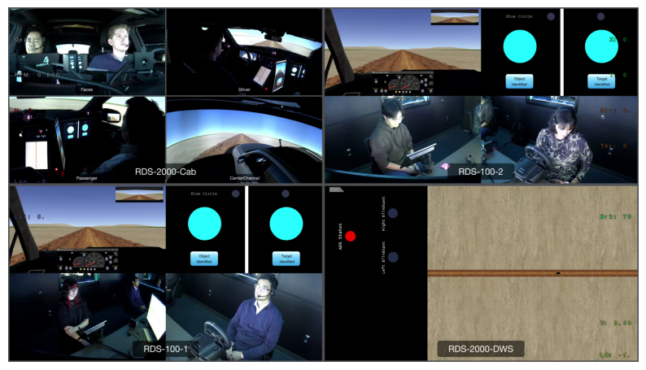
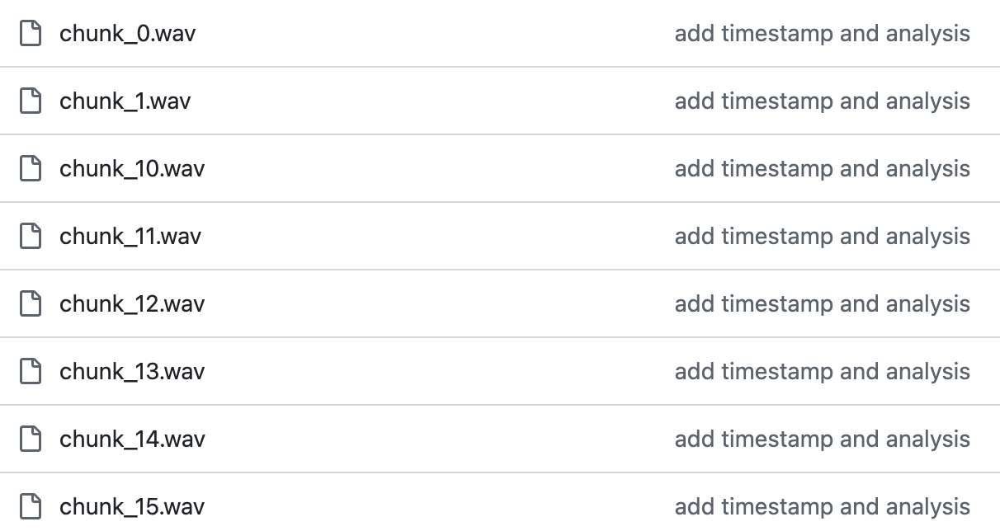
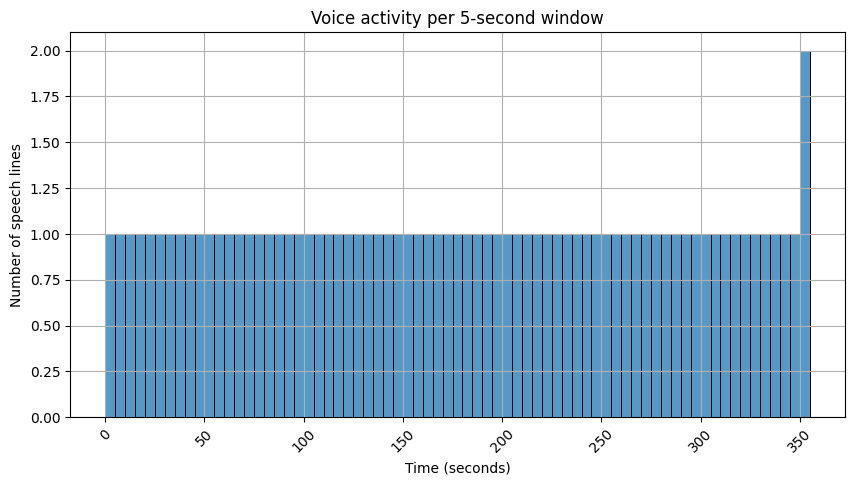
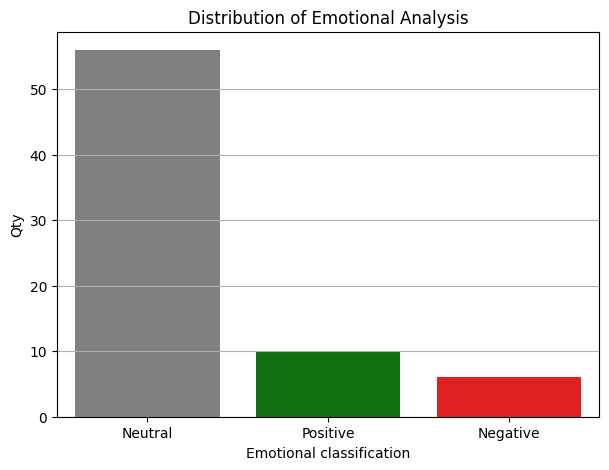

# **Video Transcription & Sentiment Analysis**

## **Project Overview**

1. Extract audio from a [video](https://alabama.box.com/s/vnwa6b4qi42ts39exv8jej6vzabdu78k) file.
2. Segment audio into 5-seconds [chunks](https://github.com/CharcoalF/Human-AI-Interaction/tree/main/wav).
3. Enhance audio quantity and save as [new chunks](https://github.com/CharcoalF/Human-AI-Interaction/tree/main/wavEnhanced).
4. Perform speech-to-text transcription using [Whisper](https://github.com/openai/whisper).
5. Conduct sentiment analysis on the transcribed text using [TextBlob](https://github.com/sloria/TextBlob).
6. Save results in CSV.
7. Visualize:
   - Histogram - voice activity per 5-second window
   - Sentiment Classification Chart - Statistical Positive / Neutral / Negative Ratio

**📺 Explanation Video:**  
[](https://youtu.be/xn9oyGLLxtQ)

## **⚙️ Installation**

```bash
pip install -r requirements.txt
sudo apt install ffmpeg  # Linux
brew install ffmpeg  # macOS
winget install ffmpeg  # Windows
```

#### `requirements.txt` contents:

```txt
pandas
numpy
opencv-python
matplotlib
tqdm
ipython
speechrecognition
pydub
textblob
nltk
seaborn
vosk
wave
```

## **Execution Instructions**

Ensure you have download the [video](https://alabama.box.com/s/vnwa6b4qi42ts39exv8jej6vzabdu78k).

```bash
python main.ipynb
```

## **Processing Details**

### **Step 1: Load Video & Get Metadata**

🔹 **Model:** OpenCV 🔹 **Input:** Video files (`.mp4` format) 🔹 **Output:** Metadata

| MetaData         |                    |
| ---------------- | ------------------ |
| # of frames      | 10691.0            |
| Frame Height     | 10691.0            |
| Frame Width      | 10691.0            |
| Frame per second | 29.964424428092247 |



### **Step 2: Extracting Audio**

🔹 **Model:** ffmpeg  
🔹 **Input:** Video files (`.mp4` format)  
🔹 **Output:** Audio files (`.wav` format)

1️⃣ Invoke `ffmpeg` to extract audio from video.

2️⃣ `"-ac", "1"`: Convert audio to single-channel

3️⃣ `"-ar", "16000"`: Set audio sample rate to 16 kHz (16,000 Hz).

4️⃣ `"-acodec", "pcm_s16le"`: Specify the audio encoding format as pcm_s16le, i.e. linear PCM encoding, 16-bit small-end format (uncompressed audio format, commonly used for high-quality audio)


### **Step 3: Segmenting Audio**

🔹 **Model:** AudioSegment
🔹 **Input:** Audio files (`.wav` format)  
🔹 **Output:** chunk_i.wav

1️⃣ Split into 5-second segments for efficient processing.



### **Step 4: Enhance Segmenting Audio**

🔹 **Model:** AudioSegment
🔹 **Input:** chunk_i.wav  
🔹 **Output:** chunk_i_enhanced.wav

1️⃣ Enhance the volume
`audio + 10`: Increase audio by 10 decibels (dB) to increase the volume and make the audio louder

2️⃣ Human voice is usually between 300 Hz and 3 kHz.

`high_pass_filter(louder_audio, cutoff=300)`: Frequencies in the audio that are lower than 300 Hz are filtered out, removing low-frequency noises, such as wind, bass, etc.

`low_pass_filter(filtered_audio, cutoff=3000)`: Frequencies in the audio above 3000 Hz will be filtered out.

3️⃣ Normalise to balance the volume
`normalized_audio = normalize(filtered_audio)`: adjust the overall volume of the audio so that the maximum volume of the audio reaches a certain standard value (usually 0 dB) to help balance the volume of the audio from being too high or too low

4️⃣ Save the processed audio

### **Step 5: Transcribe each chunk**

🔹 **Model:** Whisper (`base` model)  
🔹 **Input:** chunk_i_enhanced.wav  
🔹 **Output:** CSV file with timestamps and transcriptions

| Timestamp | Transcription                                    |
| --------- | ------------------------------------------------ |
| 0s        | Okay, so the                                     |
| 5s        |                                                  |
| 10s       | you're going to complete and use the key auto... |
| 15s       | upgrade vehicle, and keep your needs off the ... |
| 20s       | Okay, so when you see that some driver indica... |

The output file is named: `whisper_video_1731617801_transcripts.csv`

### **Step 6: Sentiment Analysis**

🔹 **Model:** TextBlob (A lexicon-based sentiment analysis tool)  
🔹 **Input:** chunk_i_enhanced.wav  
🔹 **Output:** CSV file with timestamps, transcriptions, Sentiment

| Timestamp | Transcription                                    | Sentiment |
| --------- | ------------------------------------------------ | --------- |
| 0         |                                                  | Neutral   |
| 5         | Okay, so the                                     | Positive  |
| 10        | you're going to complete and use the key auto... | Positive  |
| 15        | upgrade vehicle, and keep your needs off the ... | Positive  |
| 20        | Okay, so when you see that some driver indica... | Positive  |

The output file is named: `video_1731617801_sentiments.csv`

### **Step 7: Visualization & Analysis**

1️⃣ Voice Activity Histogram

- Histogram - voice activity per 5-second window



2️⃣ Sentiment Distribution Plot

- Sentiment Classification Chart - Statistical Positive / Neutral / Negative Ratio


